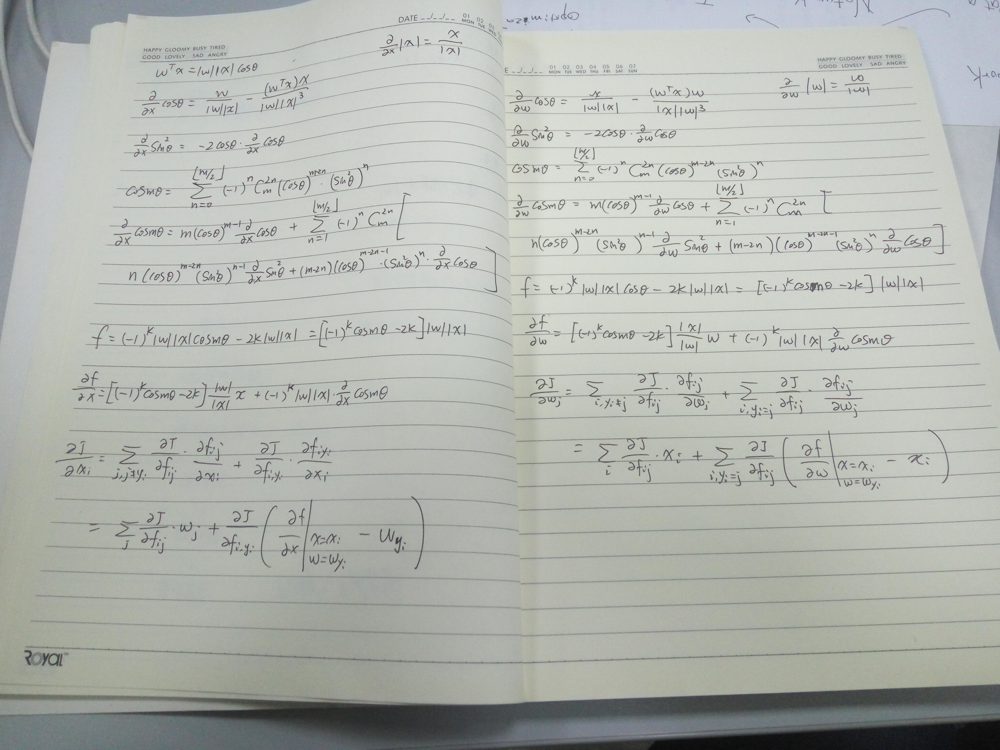
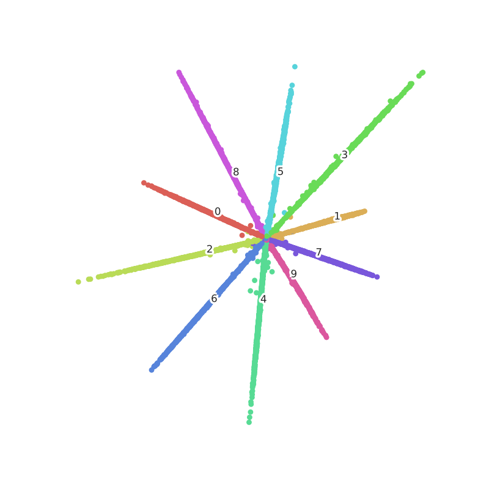

mx-lsoftmax
===========

mxnet version of [Large-Margin Softmax Loss for Convolutional Neural Networks][lsoftmax].

## Derivatives

I put all formula I used to calculate the derivatives below. You can check it by yourself. If there's a mistake, please do tell me or open an issue.

The derivatives doesn't include `lambda` in the paper, but the code does. Instead of using `lambda` to weight the original `f_i_yi = |w_yi||x_i|cos(t)`, the code uses `beta` because lambda is a keyword for Python, but `beta` plays exactly the same role as `lambda`.

## Gradient Check

Gradient check can be failed with data type float32 but ok with data type float64. So don't afraid to see gradient check failed.

## Operator Performance

I implement the operator both in Python and C++(CUDA). The performance below is training LeNet on a single GTX1070 with parameters margin = 4, beta = 1. **Notice** the C++ implement can only run on GPU context.

|Batch Size     |traditional fully connected    |lsoftmax in Python         |lsoftmax in C++(CUDA)      |
|---------------|-------------------------------|---------------------------|---------------------------|
|128            |~45000 samples / sec           |2800 ~ 3300 samples / sec  |~40000 samples / sec       |
|256            |~54000 samples / sec           |3500 ~ 4200 samples / sec  |~47000 samples / sec       |

## Visualization

### original softmax (traditional fully connected)

### lsoftmax with margin = 2, beta = 100 and scale = 0.99

### lsoftmax with margin = 3, beta = 100 and scale = 0.99

### lsoftmax with margin = 4, beta = 100 and scale = 0.99

### lsoftmax with margin = 6, beta = 1000 and scale = 0.99

## References

- [MXNet][mxnet]
- [pangyupo/mxnet_center_loss][mxnet-center-loss]
- [Large-Margin Softmax Loss for Convolutional Neural Networks][lsoftmax]
- [wy1iu/LargeMargin_Softmax_Loss][LargeMargin_Softmax_Loss]

[mxnet]: https://github.com/dmlc/mxnet
[lsoftmax]: https://arxiv.org/pdf/1612.02295.pdf
[mxnet-center-loss]: https://github.com/pangyupo/mxnet_center_loss
[LargeMargin_Softmax_Loss]: https://github.com/wy1iu/LargeMargin_Softmax_Loss
